# University-Carpooling
A java web application on university car pooling

## Language  
Java Core
## Front-end 
HTML and CSS 
## Dynamic content & back-end 
 JSP, Servlets
## Database
JDBC, Oracle DB 

# Screenshots:

## Registration:

mail - should be @annauniv.edu

Mobile - 10 digits

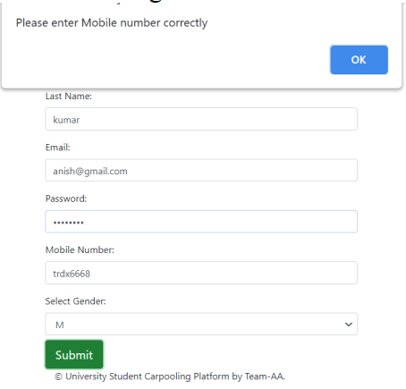

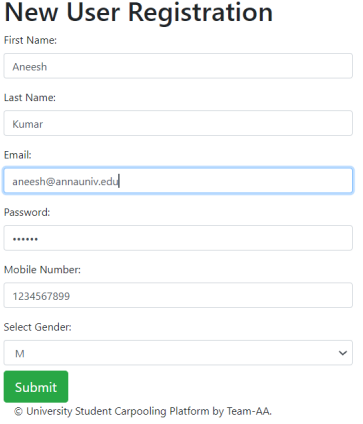

### After Successful SignUp,redirected to login page
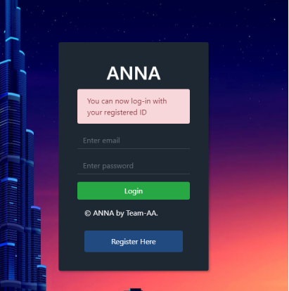

## Login:

mail - should be @annauniv.edu

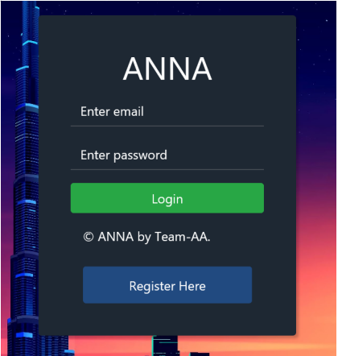

If wrong password/Username

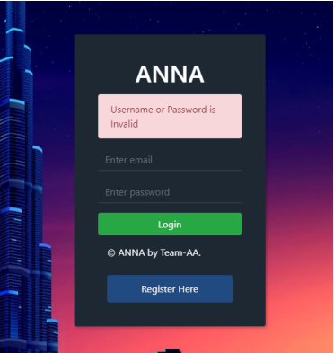

## Admin:

### Views driver application

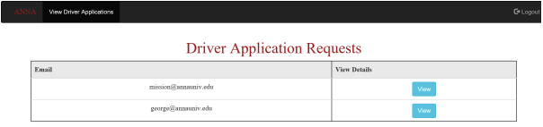

### Views driver details

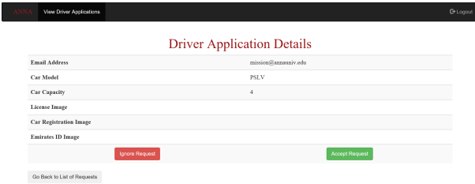

### Can Ignore or accept driver applications

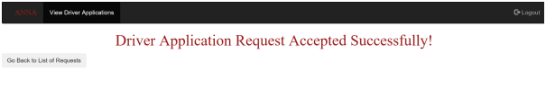

## Passenger:

### Options Available for passenger

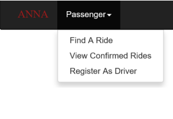

### Finding a ride

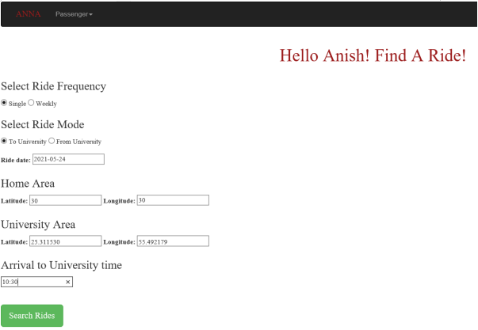

### Found Ride

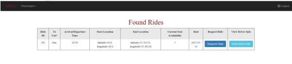

### View driver of ride

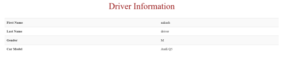

### Requested the ride

### Can view our confirmed rides

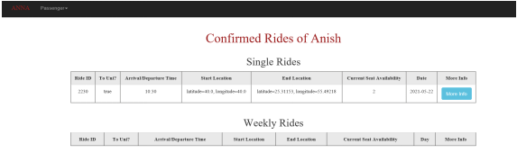

### Can also Apply to become as a driver.

## Driver:

### Options for driver

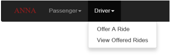

### Can offer ride

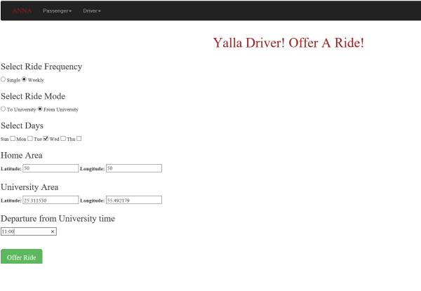

### Can view offered rides

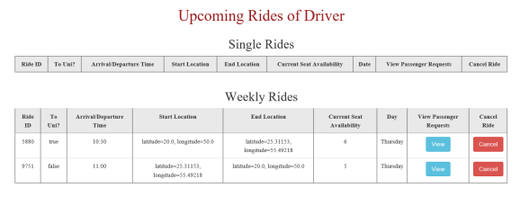

### Can cancel a ride

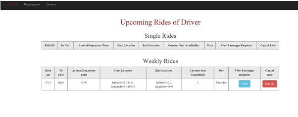

### Can view, remove, and confirm passenger requests.

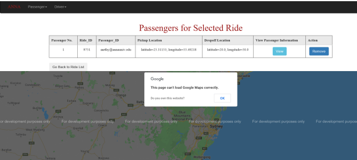

# Database – Tables Used

## Accounts

### Has all account username and password

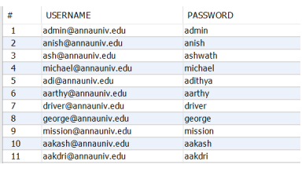

## Users

### Has passenger/User details

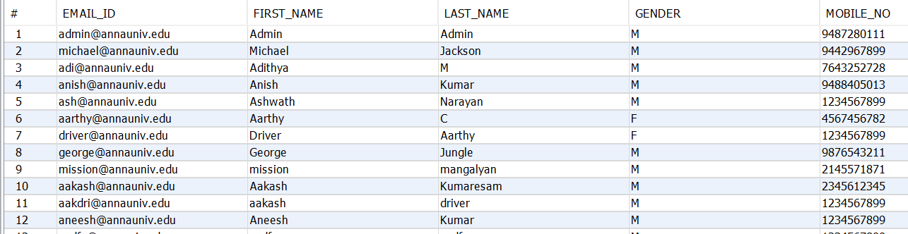

## Admins

### Has admin credentials

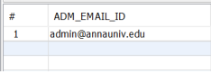

## Drivers

### Has driver details

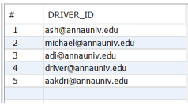

## Driver_application

### Has driver requests made by passengers

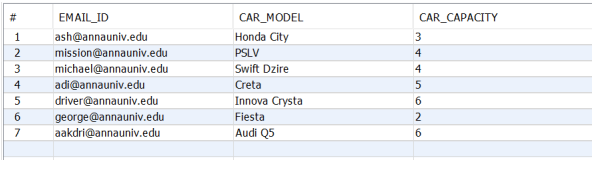

## Offered_rides

### Has rides offered by drivers

## Offered_single_rides

### Has single rides offered by drivers

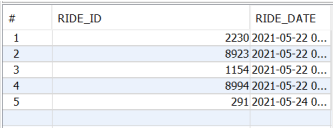

## Offered_weekly_rides

### Has weekly rides offered by drivers

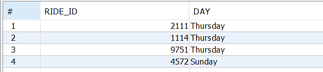

## Ride_requests

### Has ride request made by passengers

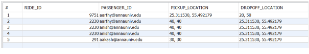

## Confirmed_rides

### Has confirmed requests

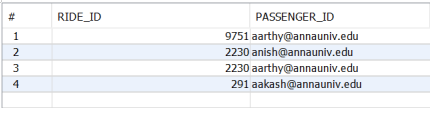
