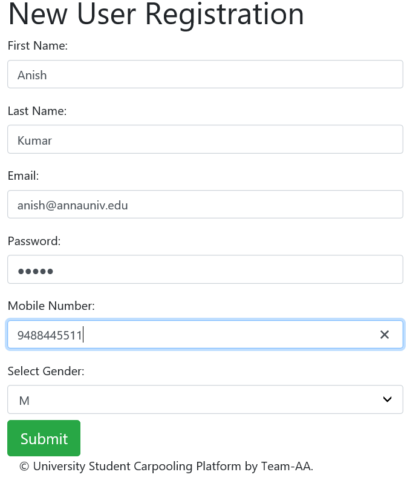

# University-Carpooling
A java web application on university car pooling

## Language  
Java Core
## Front-end 
HTML and CSS 
## Dynamic content & back-end 
 JSP, Servlets
## Database
JDBC, Oracle DB 

Registration:

mail - should be @annauniv.edu
Mobile - 10 digits

# Screenshots:

## Registration:

mail - should be @annauniv.edu

Mobile - 10 digits

### After Successful login,redirected to login page

## Login:

mail - should be @annauniv.edu

If wrong password/Username

## Admin:
Views driver application

View details

Can Ignore or accept

## Passenger:

Options Available
# ten.png

Finding a ride
# eleven.png

Found Ride
# twelve.png

View driver of ride
# thirteen.png

Requested the ride
# fourteen.png
Can view our confirmed rides
# fifteen.png

Can also register as driver.

## Driver:
# sixteen.png

Options for driver
# seventeen.png

Can offer ride
# eighteen.png

Can view offered rides
# nineteen.png

Can cancel a ride
# twenty.png

View passengers requested can view them,remove them,confirm them.

# Database – Tables Used

## Accounts

Has all accounts
# twenty one.png

## Users

Has all account details
# twenty two.png

## Admins

Has admin credentials
# twenty three.png

## Drivers

Has drivers
# twenty four.png

## Driver_application

Has driver requests made by passengers
# twenty five.png
## Offered_rides

Has rides offered by drivers
# twenty six.png

## Offered_single_rides

Has single rides offered by drivers
# twenty seven.png

## Offered_weekly_rides

Has weekly rides offered by drivers
# twenty eight.png

## Ride_requests

Has ride request made by passengers
# twenty nine.png

## Confirmed_rides

Has confirmed requests
# thirty.png

